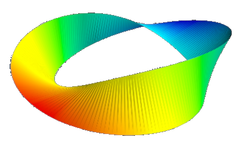

# MathTrusion
This tool creates a 3D from a 2D shape, just like the extrusion-tool from CAD Software like Fusion360, but instead of drawing lines and adjusting some parameters you hand over mathematical functions. 
Basically you choose the base shape plus the path along which it is extruded and optionally a rotation and/or a scaling of the shape along that path.

## preview of the GUI

## some models i created with this tool:

## required python libraries:
- numpy
- scipy
- matplotlib
- PySimpleGUI
- mayavi (can run without this, but is needed for saving the 3D-model)

## To-Do:
- rewrite main.py with classes for window etc.
- catch wrong input and add error messages
