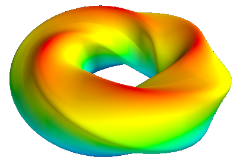
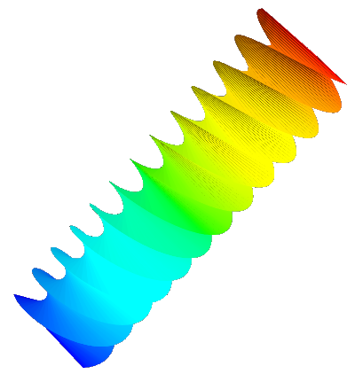

# MathTrusion
This project tries to create a 3D from a 2D shape, just like the extrusion-tool from CAD Software like Fusion360, but instead of drawing lines and adjusting some parameters you hand over mathematical functions. 
Basically you choose the base shape plus the path along which it is extruded and optionally a rotation and/or a scaling of the shape along that path.

## some examples:

Libraries used: numpy for math and mayavi for creating and viewing the 3D models.
